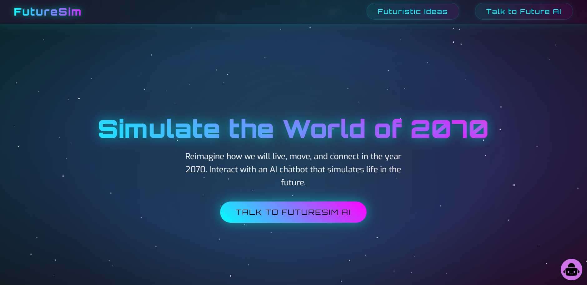
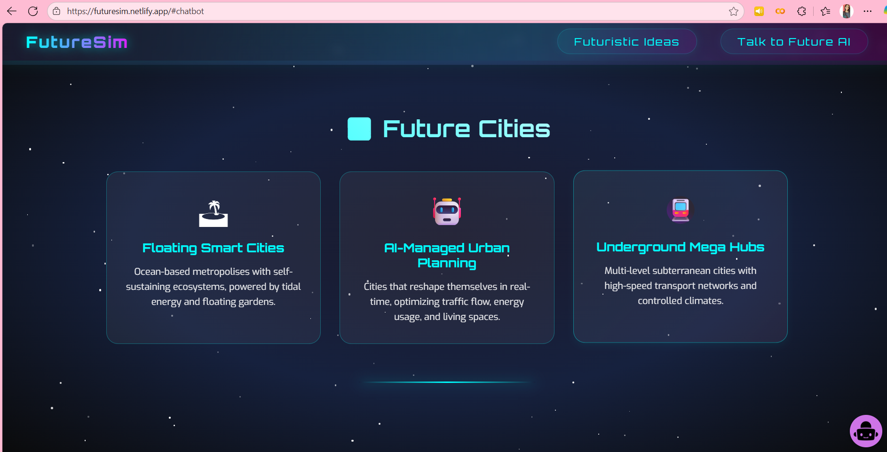

# FutureSim 🚀 – Hackathon Project

**FutureSim** is a hackathon project created for the **Copilot Jam Hackathon**, organized by the **Coding Connoisseur Coding Club** of **FoET, University of Lucknow New Campus**.  

This project combines a sleek, interactive frontend with a powerful AI chatbot using **Chatbase** and **GPT-4o Mini**, creating a **future simulator for the year 2070**. Step into the future and explore possibilities like never before!  

---

## ✨ Main Features

- **Future Simulator:** Predict and explore life in the year 2070  
- **AI Chatbot:** GPT-4o Mini-powered assistant integrated via Chatbase  
- **Interactive Frontend:** Responsive, mobile-friendly interface using HTML, CSS & JavaScript  
- **Creative Insights:** Brainstorm futuristic ideas, science innovations, and societal possibilities  
- **Easy AI Integration:** Chatbot works via a simple iframe—no backend setup required  

---

## 🛠 Tech Stack

- **Frontend:** HTML5, CSS3, JavaScript  
- **AI Integration:** Chatbase (GPT-4o Mini)  
- **Version Control:** Git & GitHub  
- **Hosting:** GitHub Pages / Netlify / Vercel  

---

## 📁 Project Structure

```plaintext
FutureSim/
│
├── assets/
│   └── bot.svg
│
├── chatbot/
│   └── (chatbot integration files)
│
├── agent_instructions/
│   └── basic_instructions.txt
│
├── training_data/
│   ├── beyond_earth_2070.txt
│   ├── chatbot_personality.txt
│   ├── daily_life_society_2070.txt
│   ├── environment_energy_2070.txt
│   ├── future_cities_2070.txt
│   ├── health_body_2070.txt
│   ├── technology_ai_2070.txt
│   ├── transport_travel_2070.txt
│   └── chatbase_iframe.txt
│
├── frontend/
│   ├── index.html
│   ├── script.js
│   └── styles.css
│
├── screenshots/
│   ├── Screenshot (402).png
│   ├── Screenshot (407).png
│   ├── Screenshot (408).png
│   ├── Screenshot (409).png
│   ├── Screenshot (410).png
│   └── Screenshot 2025-08-30 152930.png
│
└── README.md
```

---

## 🌐 Deployed Project

- **Deployed Site:** [FutureSim Deployed Web App](https://futuresim.netlify.app/)  
- **Demo Video:** [Watch Demo](demo3.mp4)  

---

## 📸 Screenshots


.png)

.png)

---

## 🎉 Conclusion & Credits

FutureSim is a hackathon project developed by **Team CodeDivas** for the **Copilot Jam Hackathon**, organized by the **Coding Connoisseur Coding Club, FoET, University of Lucknow New Campus**. 🚀  

We combined creativity, technology, and AI to build a futuristic simulator for the year 2070. Special thanks to everyone who supported and inspired us during this hackathon.  

**Team Members:**  
- Ishita Singh – Team Leader & AI Integration  
- Anchal – Frontend Development  
- Priya – Documentation & Presentation  

We hope **FutureSim** inspires creativity, sparks innovation, and brings the future a little closer to today! ✨


